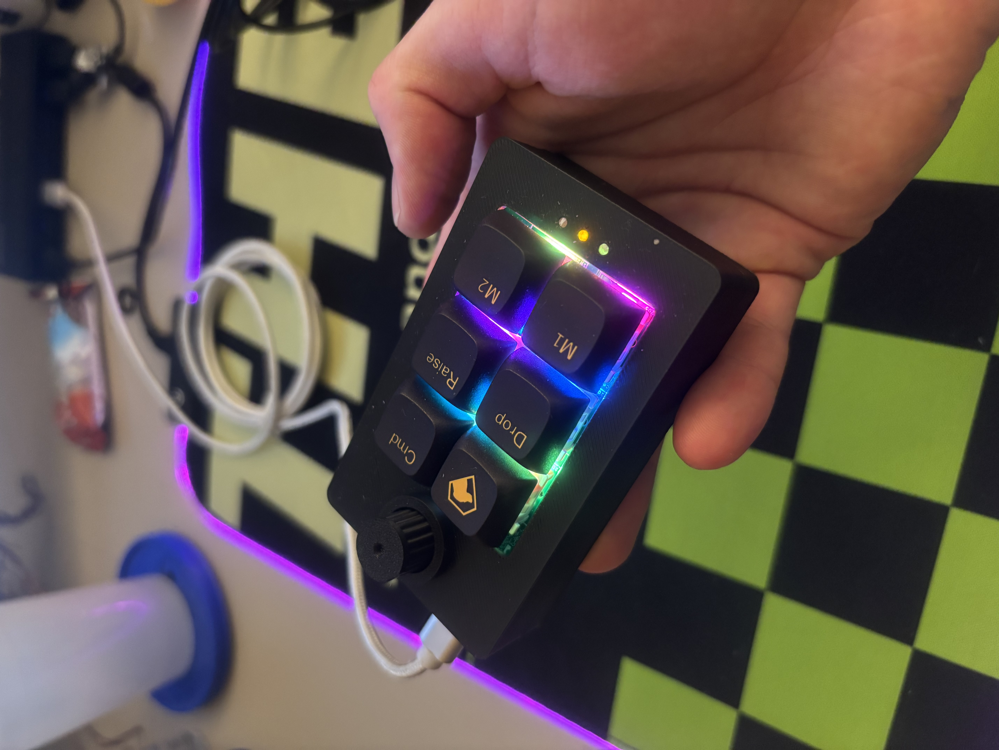

# Business Card Macro Pad
As an electrical engineer, I wanted to design a business card that can also help the people with whom I am networking. This business card doubles as an RP2040 macro pad, which can be programmed to include any custom key bindings. Special thanks to Robert Feranec at FEDEVEL which this board makes heavy modifications to. His playlist is here: <https://www.youtube.com/playlist?list=PLXvLToQzgzdftro2qK5In8p6ExsDFdpzw>

In addition, this repository includes the Gerber files, BOM, PnP, and 3D shell files to manufacture this board. Firmware exists in the Software directory, where you can use qmk to flash the board and via to program it once it is flashed. This picture is the final product:

